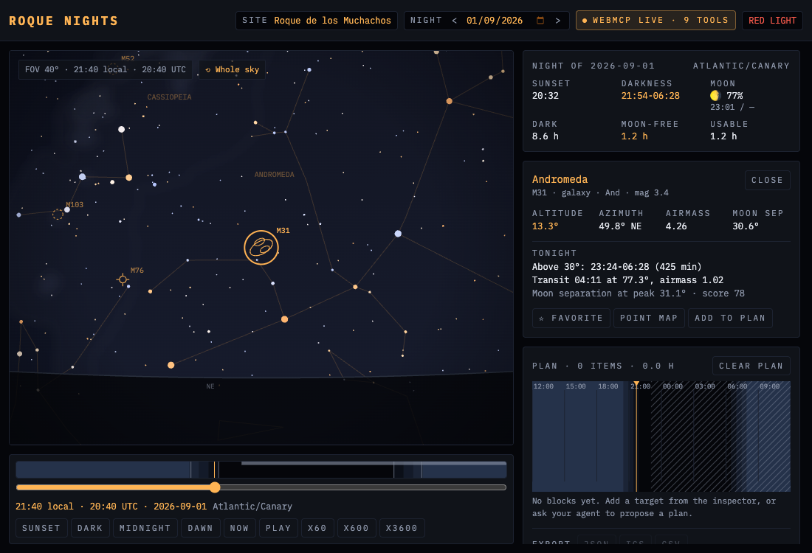

# Roque Nights

**An agent-native planner for a night under the stars.** Everything on the page is computed in your browser from an ephemeris, and your agent drives the very same instrument you are looking at: it points the sky dome, proposes a plan you accept or reject with the mouse, and reads back what you have on screen.

Live: **https://roque-nights.netlify.app**

Built at the Roque de los Muchachos (La Palma, Canary Islands), a Starlight Reserve and the site of the world's largest optical telescope. It works for any coordinates on Earth.



## Why this needs WebMCP

There is no Roque Nights API. Darkness windows, Moon interference, altitudes, airmass, transit times and the whole 5044 star dome are computed locally with [astronomy-engine](https://github.com/cosinekitty/astronomy); the only network call in the app is an optional cloud forecast for `compare_dark_sky_sites`. A classic MCP server has nothing to wrap here: there is no endpoint behind this page, and shipping one would mean recomputing the same ephemeris on someone else's machine.

What an agent actually needs is the running page: the state the human is looking at, the map the human is dragging, the plan the human is halfway through building. That is exactly what WebMCP exposes, so this is not "a website that also has an API". It is one instrument with two operators.

The architectural consequence is the interesting part. Tools are thin wrappers over the same store actions the buttons call, and every action carries `source: 'human' | 'agent'`. Bidirectionality is not a feature we added, it is a property of the design: the agent cannot do anything the human cannot see, and it can read anything the human can.

## Try it with an agent

1. **Chrome 149 or newer**: open `chrome://flags/#enable-webmcp-testing`, enable it, restart, then load https://roque-nights.netlify.app. The header badge turns to `WEBMCP LIVE · 11 TOOLS`.
2. **ChatGPT desktop (GPT-5.6 Sol or Terra)**: open the page in the built-in browser and turn on **Site tools**. GPT-5.6 Luna does not call site tools.
3. **No WebMCP browser at hand**: open the **Agent harness** panel at the bottom of the right column. It runs the same tool objects an agent would, through `document.modelContext.executeTool` when the browser has it and directly when it does not, and every call lands in the activity log exactly the same way.

### Agent playbook

Five prompts that exercise the whole product. They are also in the app, with a copy button each.

```
Plan me tonight from the Roque: darkness, Moon and the 5 best targets, then propose a plan.
Point the sky map at Saturn and tell me when it culminates.
Which night between Sep 5 and Sep 20 is best here? Set the app to it.
What am I looking at right now? Add my favorites to the plan.
Compare tonight at Mauna Kea, Paranal and here, weather included.
```

## The 15 tools

Eleven are registered for the life of the page. Four are **contextual**: they are registered and unregistered as the store changes, because `modify_plan` is meaningless without a plan and `commit_proposal` is meaningless without a pending proposal. `clear_plan` is deliberately NOT contextual: it hands out the undo token, so unregistering it the moment it emptied the plan would take the undo away with it. Models do not re-read the tool list on their own, so the tool whose call caused the change reports `tools_added` and `tools_removed` in its own payload.

Every tool returns the same envelope: `{ ok, summary, data, rejected[], caveats[], site, as_of }`. `summary` is one quotable sentence, `data` holds the numbers behind it, and `rejected` always carries a reason. No tool ever throws: failures come back as `{ ok: false, error: { code, message, hint } }`.

| # | Tool | Use it when | Annotations | Registered |
|---|---|---|---|---|
| 1 | `get_night_ephemeris` | You need the darkness window, Sun and Moon for one night and site. Says explicitly when there is no astronomical darkness or the Sun never sets. | readOnly, idempotent | always |
| 2 | `find_observable_targets` | You want the Messier objects and planets that actually work tonight, plus the ones that do not and why. | readOnly, idempotent | always |
| 3 | `rank_nights` | You need the best **astronomical** night in a date range, scored by dark hours free of Moon. Astronomy only: it says out loud that it knows nothing about the weather. Honours `AbortSignal`. | readOnly, idempotent | always |
| 4 | `point_sky_map` | You want the human to SEE what you are talking about. The dome swings to the target with easing and leaves a reticle. | writes view, idempotent | always |
| 5 | `set_observing_time` | You need the whole page (map, timeline, inspector) at a different instant. Accepts `sunset`, `midnight`, `darkness_start` or an ISO time. | writes time, idempotent | always |
| 6 | `describe_current_view` | Page to agent. Centre, field of view, selection, favourites, filters and the last 20 things the human did with the mouse. | readOnly, idempotent | always |
| 7 | `propose_plan` | You have a plan in mind. It becomes a dotted ghost plan the human accepts or rejects item by item, with reasons that come back to you. | writes proposal | always |
| 8 | `commit_proposal` | The human has reviewed the ghost plan. Rejected items are skipped and returned with their reasons so you can renegotiate. | idempotent | **contextual**: only while a proposal is pending |
| 9 | `modify_plan` | Add, remove, reorder or move blocks in one batch. One tool, not four. | not idempotent (a repeated `add` is a second block) | **contextual**: only with a plan |
| 10 | `get_current_plan` | You need the committed plan with its real times, magnitudes, transit times, altitudes and warnings. | readOnly, idempotent | **contextual**: only with a plan |
| 11 | `clear_plan` | The human asked to start over. Requires `confirm: true`, refuses otherwise with `confirmation_required` and leaves a banner for the human, and returns an undo token. | **destructive**, not idempotent | always, so the undo it promises stays callable |
| 12 | `export_plan` | The plan has to leave the browser: `json` (open schema), `ics` (calendar) or `csv`, plus a share URL that carries the whole plan. Refuses with `plan_stale` when the app has moved since the plan was committed. | readOnly, idempotent | **contextual**: only with a plan |
| 13 | `import_plan` | Someone sent a plan. It is REVALIDATED for this latitude and this night, target by target, and you get the diff with reasons. | writes proposal | always |
| 14 | `compare_dark_sky_sites` | Comparing 28 dark-sky sites worldwide for one night, optionally with cloud cover, humidity and jet stream from Open-Meteo in a single request. | readOnly, **openWorld** | always |
| 15 | `set_observing_site` | The page itself has to move to another site. Every read-only tool takes a one-off `site` argument that answers *about* a place; this one moves the app, and reports whether the committed plan is now stale. | idempotent, not destructive | always |

`clear_plan` never blocks on a click inside the agent's turn. It returns `confirmation_required` and drops a banner in the page; the human confirms in their own time. Nothing in this app makes an agent wait for a mouse.

### The declarative form and the tool beside it

The observing site can be changed two ways, and both are the same code. The `<form>` in the site dialog carries `toolname="set_observing_site_form"` (a distinct name: the engine refuses two tools called the same), stays mounted whether the dialog is open or not, and answers the `agentInvoked` event with `respondWith`: that is WebMCP's **declarative** API, and the agent fills in the same fields the human does. `set_observing_site` (row 15) is its imperative twin, for an agent that would rather call a named tool than find a form in a DOM it cannot see. Both paths, and the human's own submit button, end in one function, `applySitePayload()` in `src/site/applySitePayload.ts`: one validation path, one set of error messages, one place that writes the store. Coordinates without an IANA time zone are accepted, and every local time from then on is `null` with a caveat that says so, because inventing a time zone is worse than admitting you do not know one.

Moving the app does not delete a plan built somewhere else. It marks it stale: the person gets a Revalidate banner, `get_current_plan` adds a caveat, and `export_plan` refuses with `plan_stale` until the person revalidates or keeps it anyway.

## The open plan format

`export_plan` writes **`observing-plan.v1`**, published from this site at

**https://roque-nights.netlify.app/schemas/observing-plan.v1.json**

The document carries the site, the night and the darkness window it was built for, not just a list of targets, so that a reader can recompute every time for their own sky instead of trusting the author's. Anyone may implement it. `import_plan` accepts that document, a share URL of this app (`#plan=...`), or a plain list of target names.

Open a share link and the page runs the exact code path the tool runs: the plan is revalidated for your site and your night, it arrives as a ghost proposal you approve item by item, and a banner tells you where it came from. A plan made in Madrid does not import as data, it imports as a set of intentions that this sky gets to argue with.

## Architecture

```
src/astro/*      pure, headless astronomy (astronomy-engine, everything in UTC)
       |
src/state/store.ts   one vanilla Zustand store: site, night, time, view, plan,
       |             proposals, activity log, human action ring buffer
       +-------------------------------+
       |                               |
src/ui/*, src/sky/*              src/tools/*  (15 tools)
React reads the store            thin wrappers over the SAME store actions
and writes it with               the buttons call, with source: 'agent'
source: 'human'                        |
                                 src/webmcp/registerTools.ts
                                 registers outside React, at module level
```

Notes worth their line:

- **Registration lives outside React.** StrictMode double-mounts effects, so an `AbortController` cleaned up in a `useEffect` silently unregisters the tools it just registered. The bug only shows against a production build, which is far too late to find it. `registerWebMCPTools()` is called from `main.tsx` before `createRoot`.
- **Every tool call is instrumented.** The activity log shows `running`, then `ok` or `error`, with the duration in milliseconds and an excerpt of the summary the agent received. The human sees what the agent was told, not just what it asked.
- **The dome is a canvas 2D stereographic projection** of the whole sky, drawn from a pure scene builder: 5044 stars sized by magnitude and coloured by B-V, 88 constellation figures, the Milky Way isophotes, the 110 Messier objects with a glyph per type, planets, and the Moon with a halo scaled by illumination. It repaints only when an input changes or an animation is running.
- **All internal time is UTC.** Local rendering only happens through one formatter with an explicit IANA zone.
- **Right ascension** is degrees in the catalogs and hours in astronomy-engine. One helper does the conversion, and a golden test pins M31 at 10.685 degrees.

## Data and licences

Sky catalogs are vendored from [d3-celestial](https://github.com/ofrohn/d3-celestial) (BSD 3-Clause), ephemeris from [astronomy-engine](https://github.com/cosinekitty/astronomy) (MIT), forecast from [Open-Meteo](https://open-meteo.com) (CC BY 4.0, no key required). What each file is, what the vendoring step changes and how the positions were verified is in **[CREDITS.md](./CREDITS.md)**.

## Development

```bash
npm install
npm run dev            # vite dev server
npm test               # the whole suite: golden ephemeris values, a tool fuzz and the WebMCP registration
npm run lint           # oxlint
npm run build          # tsc -b && vite build
npm run preview        # serve the production build on :4173

# every tool, in a real browser, against the production build
node scripts/audit-webmcp.mjs http://localhost:4173/ docs/screenshots/audit.png
```

The audit script drives the 15 tools in the order a session actually happens (read-only first, then `propose_plan` and `commit_proposal`, then the contextual plan tools, then a round trip to Mauna Kea and back), asserts that every result carries a boolean `ok` and matches the outcome expected for that call (`clear_plan` without `confirm` must come back as `confirmation_required`), prints a table and exits non-zero if anything throws or answers something else. It uses the browser's own `executeTool` when the engine is there and the page's tool objects when it is not.

## What is honestly true today

- The 15 tools, the declarative form, the contextual registration, export, import and the share link are verified end to end in a real Chromium with the WebMCP testing flag, by the audit script above.
- The single tool of the first spike was tried in ChatGPT desktop Site tools with GPT-5.6 on 2026-09-01; it was discovered and chained correctly, and its feedback is what produced the structured errors and the polar-night statuses.
- There is no offline mode, no account, no server and no telemetry. The main bundle is about 800 kB (281 kB gzip), most of it the star catalog and the ephemeris.

## Roadmap

- Per-site weather in `find_observable_targets`, not only in the site comparison.
- Custom targets (comet, asteroid, an arbitrary RA and Dec) through a second declarative form.
- A session log: what was actually observed, written back into the plan.
- Offline as a real installable app, only if it can be demonstrated in flight mode rather than claimed.

## Licence

[MIT](./LICENSE).
